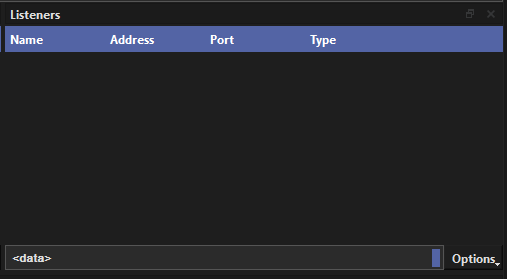

# UI Forms

## kill_listener_form_popup.ui

A UI file for a form to kill a listener.

## spawn_listener_form_popup.ui

A UI file for a form to spawn a listener.

## listener_layout_widgets.ui

The Listener Widget layout UI file.

