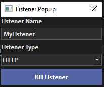

# Listener Popup

## Overview

This is a module that handles the actual logic behind managing the listeners. Currently, there are 2 classes, "SpawnListenerPopup", and "KillListenerPopup".

```
GuiUtils.open_dialog(SpawnListenerPopup, self)

```

---

# SpawnListenerPopup Class


## Overview

The `SpawnListenerPopup` class is a QDialog in a PySide application used to configure and initiate the spawning of new listeners in the application. It allows users to input details such as name, address, port, and type of the listener, and sends a request to the server to create it.

## Imports and Dependencies

- **PySide6**: Provides QDialog, QLineEdit, QComboBox, QPushButton, and other UI elements.
- **Utils**: Includes utilities for logging, event handling, data management, and web requests.

## Class Definition

### Class SpawnListenerPopup(QDialog)

#### Constructor

The constructor initializes the UI and setups the signal connections.

```python
def __init__(self, parent=None):
    super().__init__(parent)
    self.logger = BaseLogging.get_logger()
    ...
```

## Usage:
This is meant too be a popup dialog, and can be opened with the following line:


#### Private Methods

- `__ui_load()`: Loads the UI components from a .ui file.
- `__q_timer()`: Placeholder for future timer functionality.
- `__signal_setup()`: Placeholder for signal setup.

#### UI Methods

- `init_options()`: Placeholder for initializing additional options.

#### Listener Management

- `listener_decision_tree()`: Decides which listener function to call based on the selected type in the UI.
- `spawn_http_listener()`: Gathers data from the `spawn_listener_form_popup.ui` form and sends a POST request to spawn a new HTTP listener. Triggered on "Spawn Listener" button.
    - 

## Remarks

This class handles user input and server communication for creating listeners. It emphasizes modular function design for potentially expanding listener types beyond HTTP.

---

# KillListenerPopup Class

## Overview

The `KillListenerPopup` class allows users to terminate existing listeners. Users specify the listener name and type, and it sends a kill request to the server.

## Imports and Dependencies

- **PySide6**: Provides QDialog, QLineEdit, QComboBox, QPushButton, and other UI elements.
- **Utils**: Includes utilities for logging, event handling, data management, and web requests.

## Class Definition

### Class KillListenerPopup(QDialog)

#### Constructor

The constructor initializes the UI and setups the signal connections.

```python
def __init__(self, parent=None):
    super().__init__(parent)
    self.logger = BaseLogging.get_logger()
    ...
```

#### Private Methods

- `__ui_load()`: Loads the UI components from a .ui file.
- `__q_timer()`: Placeholder for future timer functionality.
- `__signal_setup()`: Placeholder for signal setup.

#### UI Methods

- `init_options()`: Placeholder for initializing additional options.

#### Listener Management

- `listener_decision_tree()`: Decides which listener function to call based on the selected type in the UI.
- `kill_http_listener()`: Gathers data from the `kill_listener_form_popup.ui` form and sends a POST request to kill an HTTP listener. Triggered on "Kill Listener" button.
    - 

## Usage:
This is meant too be a popup dialog, and can be opened with the following line:

