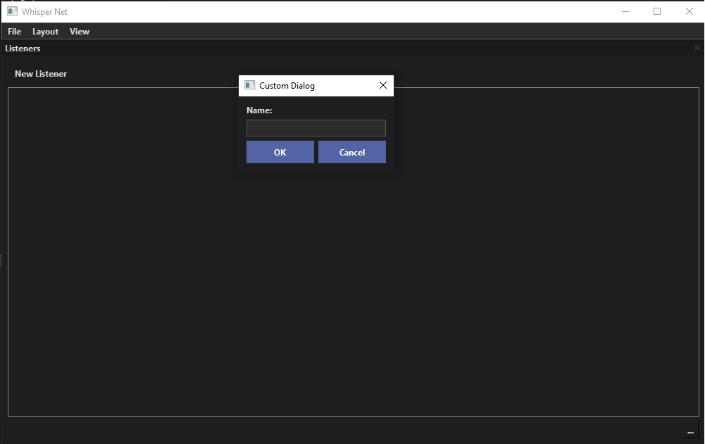
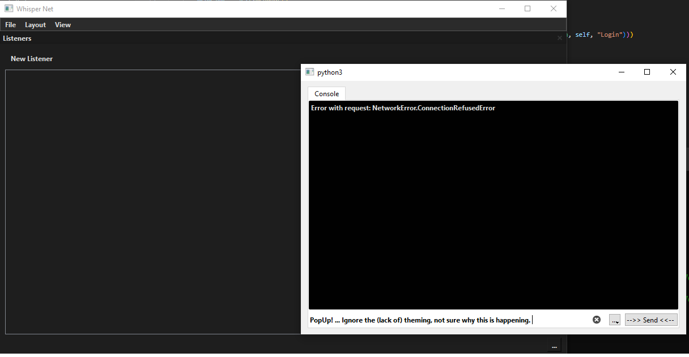
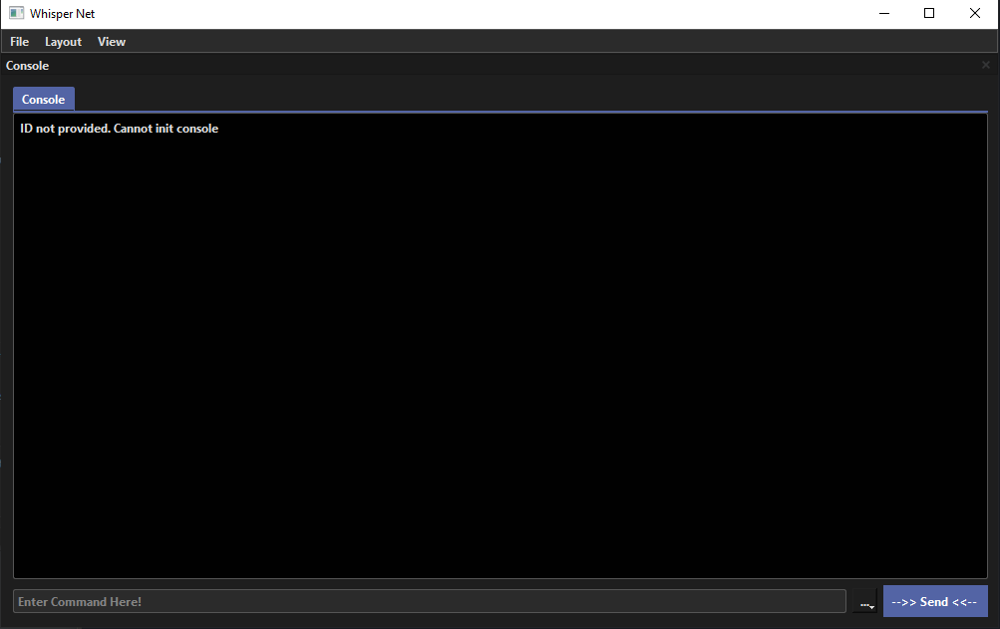

# Utils Documentation

The Utils file holds classes for various util based items for the GUI.


# GuiUtils Class

## Overview
The `GuiUtils` class offers a suite of static methods designed to facilitate the creation and management of graphical user interface components within PyQt or PySide applications. It simplifies the instantiation and display of dialogs, pop-up widgets, and dock widgets, enhancing the modularity and usability of GUI applications.

## Imports and Dependencies

- **PySide6.QtWidgets**: Provides the GUI components necessary for creating dialogs, windows, and dock widgets.
- **PySide6.QtCore**: Includes core non-GUI functionality required by the positioning and behavior of the GUI components.
- **Utils.Logger**: A custom logging utility to support debugging and logging of the application's flow and errors.

## Static Methods

### open_dialog

- **Purpose**: Creates and displays a modal dialog window from a specified `QDialog` subclass.
- **Usage**:
    ```python
    GuiUtils.open_dialog(MyCustomDialog, self)
    ```
- **Parameters**:
    - `dialog_class`: The `QDialog` subclass to instantiate.
    - `parent`: Optional. The parent widget of the dialog.

### open_popup_widget

- **Purpose**: Opens a pop-up window (non-modal) from a specified `QWidget` subclass.
- **Usage**:
    ```python
    GuiUtils.open_popup_widget(MyPopUpWidget, self)
    ```
- **Parameters**:
    - `widget_class`: The `QWidget` subclass to instantiate.
    - `parent`: Optional. The parent widget of the pop-up window.

### open_dock_widget

- **Purpose**: Dynamically creates and docks a widget inside a specified `QMainWindow`.
- **Usage**:
    ```python
    GuiUtils.open_dock_widget(MyCustomWidget, self, "My Custom Widget")
    ```
- **Parameters**:
    - `widget_class`: The widget class to be instantiated and docked.
    - `main_window`: The `QMainWindow` instance to dock the widget in.
    - `widget_title`: Optional. The title for the dock widget.

## Example Usage

This section provides practical examples of using the `GuiUtils` methods to enhance a PyQt or PySide application with dynamic GUI components.

Note: For all of these, pass the class, not the object itself, if that makes sense.

Ex:

```
from custom_class import custom_class

custom_class # Yes

custom_class() # NO! This init's the class, we just want to pass it

# Applies to all GUI popup methods
GuiUtils.open_dialog(custom_class, self)


```

### Adding a Custom Dialog
Dialog's are used for things like forms, or mini popup windows. 

```python
class MyCustomDialog(QDialog): ## < Note the QDialog
    # Dialog implementation goes here

GuiUtils.open_dialog(MyCustomDialog, self)
```




### Showing a popup widget

"pops" up a window/widget. Will put in a new window, outside of the snap layout of the main program. (See image)

```
class MyPopUpWidget(QWidget): ## < Note the QWidget
    # Widget implementation goes here

GuiUtils.open_popup_widget(MyPopUpWidget, self)
```



### Docking a custom widget in the main window:


This will put the widget in the main window of the GUI, and add it to the snap layout. (see image)

```
GuiUtils.open_dock_widget(MyCustomWidget, self, "My Custom Widget")
```


