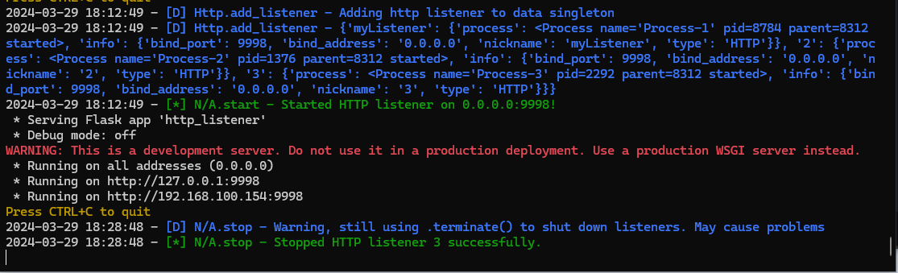

 NOT COMPLETE/IN DEV

# HttpListenerHandler Documentation

The `HttpListenerHandler` class is designed to encapsulate the logic for managing HTTP listeners, separate from the core functionalities of plugins. This separation allows plugins to focus solely on handling Flask requests and other specific tasks, while `HttpListenerHandler` takes care of listener setup, initiation, and management. The class primarily uses static methods for interaction.


## Dependencies

- `ListenerHTTP` from `PluginEngine.PublicPlugins.ListenerHTTP.ListenerHTTP`
- `Data` from `Utils.DataSingleton`
- `LoggingSingleton` from `Utils.Logger`
- `Process` from `multiprocessing`

## Methods

### `start(bind_address=None, bind_port=None, nickname=None)`

Starts an HTTP listener with the specified bind address, port, and nickname, and adds it to the Data Singleton for centralized management.

- **Parameters**:
    - `bind_address`: The IP address on which the listener will bind and listen. Default is `None`.
    - `bind_port`: The port number on which the listener will bind and listen. Default is `None`.
    - `nickname`: A unique identifier for the listener. Default is `None`.

- **Functionality**:
    1. Validates whether a listener with the same nickname already exists within the Data Singleton to avoid duplicates.
    2. Initializes an instance of `ListenerHTTP` with the provided bind address, port, and nickname.
    3. Starts the listener in a separate process to ensure it doesn't block or hang the main application flow, particularly important for HTTP calls.
    4. Adds listener information to the Data Singleton for easy management and access across the application.
    5. Logs the successful start of the listener.

- **Usage**:
  This method is a wrapper around the listener's native startup procedures, facilitating the process with additional checks and the integration with the Data Singleton for better management and oversight.

### `stop(nickname=None)`

Stops an HTTP listener based on its nickname.

- **Parameters**:
    - `nickname` (str): The unique identifier of the listener to stop. Defaults to `None`.

- **Functionality**:
    1. Retrieves the listener's information from the Data Singleton using the provided nickname.
    2. Terminates the listener's process using `.terminate()` method, effectively stopping the listener.
    3. Waits for the process to terminate using `.join()`, ensuring it has been stopped cleanly.
    4. Logs the successful shutdown of the listener to the application logs.

- **Remarks**:
    - The method uses `.terminate()` for stopping listeners, which is effective but may not allow for graceful shutdown in all cases. Future improvements could include a more graceful shutdown mechanism.

- **Example Usage**:
    ```python
    HttpListenerHandler.stop(nickname='MainListener')
    ```


## Example Usage

To start an HTTP listener:

```python
HttpListenerHandler.start(bind_address='127.0.0.1', bind_port=8080, nickname='MainListener')
```


On a successful start/stop, the following should show up in the console:


