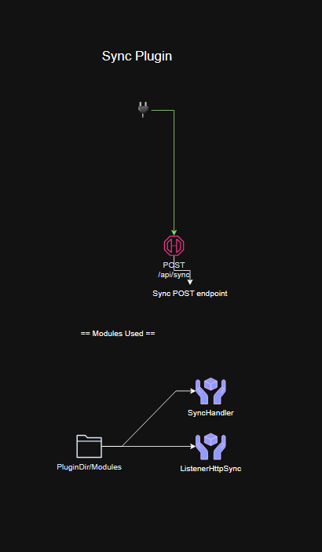
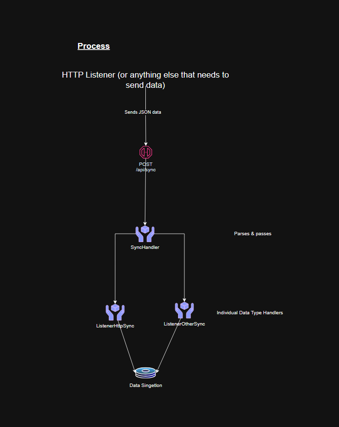

### Sync Plugin Documentation

#### Overview
The Sync plugin serves as a backend component built to synchronize data across various systems using a JSON-based API. It integrates with a Flask web framework for handling API routes and employs a centralized logging system for monitoring operations. 

In short, it takes some data in from anything that needs to share it, and stores it. 

#### Sync overview



#### Sync Process


#### Imports and Dependencies
- **os**: For interacting with the operating system.
- **logging**: For logging messages and errors.
- **inspect**: For retrieving current function names, aiding in detailed logging.
- **requests**: For making HTTP requests.
- **json**: For parsing and generating JSON data.
- **Flask**: For creating and managing web routes.
- **Flask-JWT-Extended**: For handling JWT tokens for authentication.
- **BadRequest**: From `werkzeug.exceptions`, for handling HTTP bad request errors.
- **Custom Modules**:
  - **DataEngine.SimpleC2DbHandler**: Handles database operations specific to the SimpleC2 plugin.
  - **Utils.ApiHelper**: Provides utility functions for API response handling.
  - **Utils.Logger**: A singleton logger used for centralized logging.
  - **PluginEngine.ControlPlugins.SimpleC2Plugin.Utils.ListenerHandler**: Manages HTTP listeners.
  - **Utils.DataSingleton**: Manages shared data access.
  - **PluginEngine.ControlPlugins.SyncPlugin.Modules.SyncHandler**: Processes synchronization logic.


#### Info Class
```
class Info:
    name = "Sync"
    author = "ryanq47"
    endpoint = "/sync"
    classname = "Sync"
    plugin_type = "Builtin"
```
This class holds metadata about the plugin such as name, author, endpoint, classname, and plugin_type.

#### Sync Class
```python
class Sync():
    def __init__(self, app):
        self.logger = LoggingSingleton.get_logger()
        self.data = Data()
        self.app = app
```
Initializes the plugin with Flask application, logging, and data handling configurations.

##### Main Methods
- **main()**: Sets up the plugin and registers web routes.
- **register_routes()**: Defines all the web routes and their handlers.

```python
    def handle_sync_request(self):
        """
        Handle a synchronous JSON request by parsing it and processing through SyncHandler.
        """

        ## Check if the request is JSON
        if not request.is_json:
            return "Request data is not JSON", 400

        ## Get JSON data from the request
        try:
            response = request.get_json()
        except Exception as e:
            return f"Error parsing JSON: {e}", 400

        ## Parse JSON using SyncHandler
        synchandler = SyncHandler()
        synchandler.parse_response(response=response)

        return make_response("", 200)
```
Handles incoming sync requests, verifies JSON format, and processes data through SyncHandler.

#### Remarks
This document provides a high-level overview of the Sync plugin's capabilities, focusing on its integration within a Flask framework, the handling of synchronous data processing, and interactions with a Neo4j graph database.
```

This formatted documentation should help you maintain a structured and detailed understanding of the Sync plugin's functionality and setup. If you need further details or additional sections, feel free to let me know!