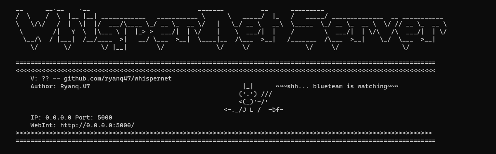

# Startup Banner Documentation

## Overview

The `StartupBanner` class is designed to generate and display startup banners for WhipserNet. It provides static methods to create customizable banners that can be displayed in the console upon application start, offering useful information such as IP, port, version, and a unique "demon say" message for a touch of personality.

## Class Description

### `startup_banner(ip=None, port=None, version=None)`

#### Purpose

Generates a startup banner with customizable IP, port, and version information, along with a randomly selected "demon say" message from a predefined list. This method is intended to be called at the application's startup to provide essential information and a bit of humor.

#### Parameters

- `ip` (str, optional): The IP address on which the application is running. Defaults to `None`.
- `port` (int, optional): The port number on which the application is accessible. Defaults to `None`.
- `version` (str, optional): The version of the application. Defaults to `None`.

#### Returns

- (str): A formatted string containing the startup banner ready to be printed to the console.

#### Demon Say Messages

A list of quirky and humorous messages is defined within the method, from which one is randomly selected each time the banner is generated. These messages add a playful element to the startup process.

### `successful_startup_banner(ip=None, port=None)`

#### Purpose

Prints a simpler banner indicating the successful start of the server. This method is intended to be called after the server has started, confirming its availability on the specified IP and port.

#### Parameters

- `ip` (str, optional): The IP address on which the server has started. Defaults to `None`.
- `port` (int, optional): The port number on which the server is accessible. Defaults to `None`.

#### Usage

Both methods are designed to be called statically at appropriate points during the application's startup sequence. `startup_banner` should be called early in the startup process to display detailed version and access information, while `successful_startup_banner` should be called once the server is confirmed to be running and accessible.

## Example Usage

```python
# At application startup
print(StartupBanner.startup_banner(ip="127.0.0.1", port=5000, version="1.0.0"))

# Once the server is successfully started
StartupBanner.successful_startup_banner(ip="127.0.0.1", port=5000)
```


