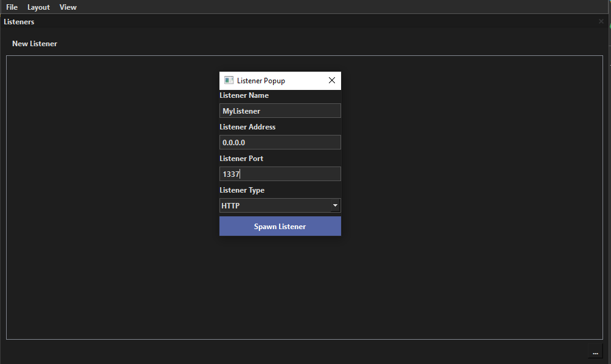
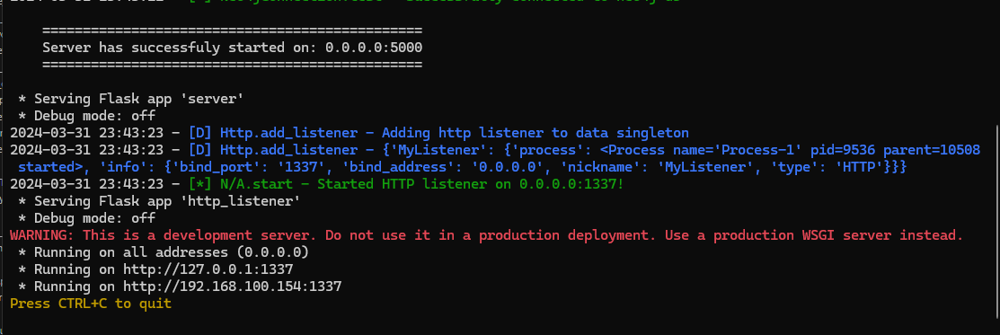

# Listener Management

## Overview
Whispernet currenlty only has one type of listener, HTTP.

## Spawning a Listener

A listener can be spawned with the "Spawn Listener" button. This will pop up a menu to enter in Listener details:

Once "Spawn Listener" is clicked, it will send an HTTP request to the server, and spin up the listener:

Then, within a few seconds, a new Listener should appear on the GUI! 

## Management from GUI

NOT IMPL.

Note: Talk about Context menu, right click for stop/start/pause/restart? etc.