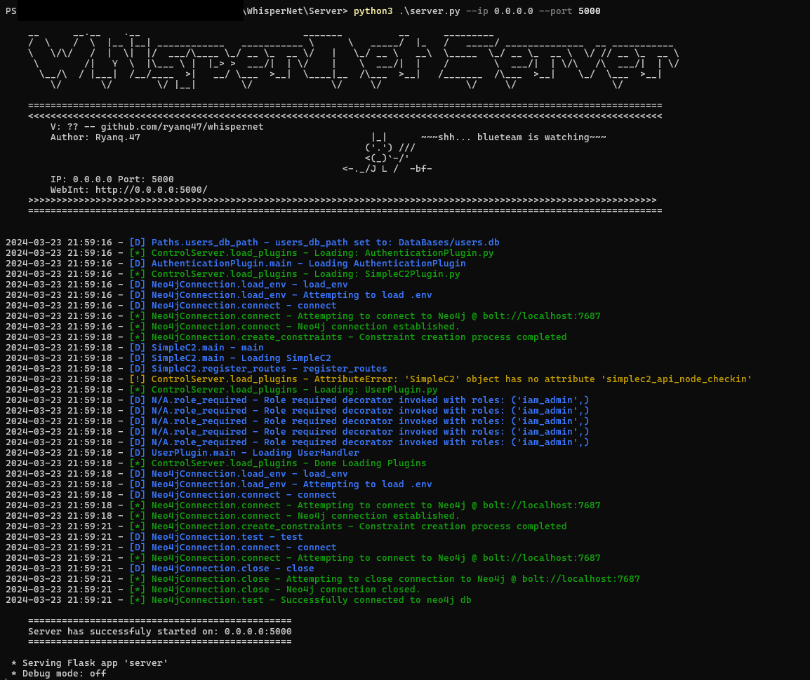
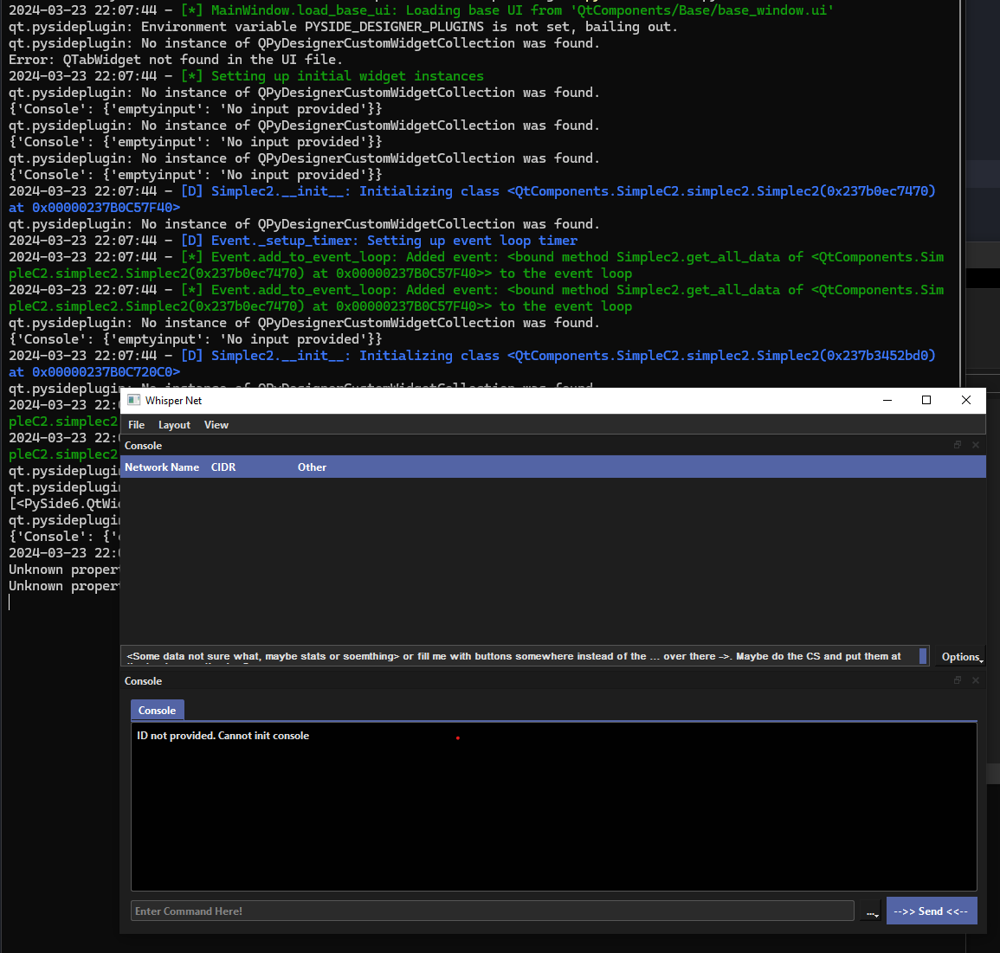

# WhisperNet Quick Start

Keeping this short, the faster you can get this up, the better!

## Installing Deps

The server, and GUI both have a `requirements.txt` file that needs to be installed.

This can be done like this:

```
python3 -m pip install -r requirements.txt
```

## Neo4j

Follow the official guide from Neo4j for installing it on your desired system. Note, I use the community version becuase it's free.

- <a href="https://neo4j.com/docs/operations-manual/current/installation/windows/" target="_blank">Windows</a>

- <a href="https://neo4j.com/docs/operations-manual/current/installation/linux/" target="_blank">Linux/Unix</a>


## Setting up .env file

The .env file holds environment variables used by the server. This consists of secrets, and other sensitive info.

```
NEO4j_URI="bolt://localhost:7687"
NEO4J_USER="user"
NEO4j_PASSWORD="password"
```

## Starting the Server

Congrats, you got the boring complicated stuff out of the way. Let's start the server now:

To start the Server, go to the `Server/` folder.

```
python3 server.py --ip 0.0.0.0 --port 5000
```

It should look something like:



## Starting the GUI

To start the GUI, go to the `GUI/` folder.

```
python3 main.py
```

It should look similar to this:




## Done!

Cewl! Now you're up and running! Check out the other docs on how to actually do things now, like logging into the server:

 - FakeLink

 - FakeLink
   
 - FakeLink